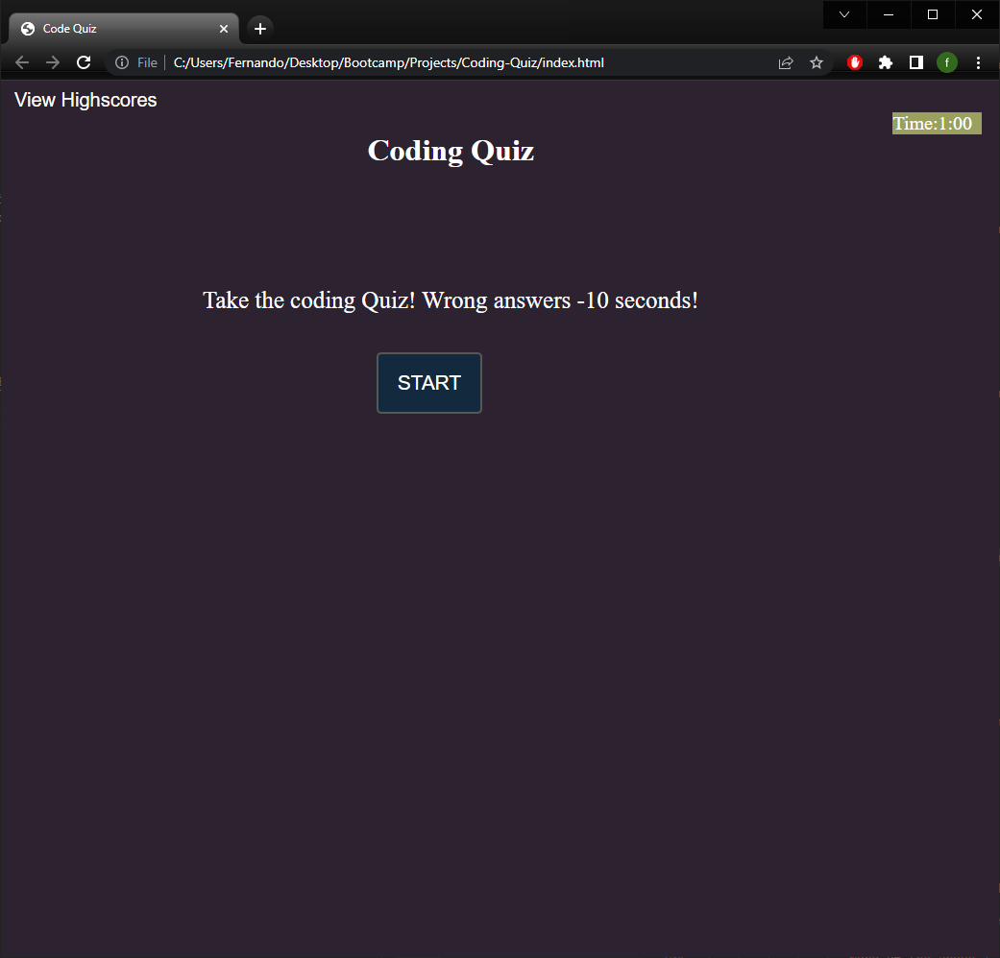
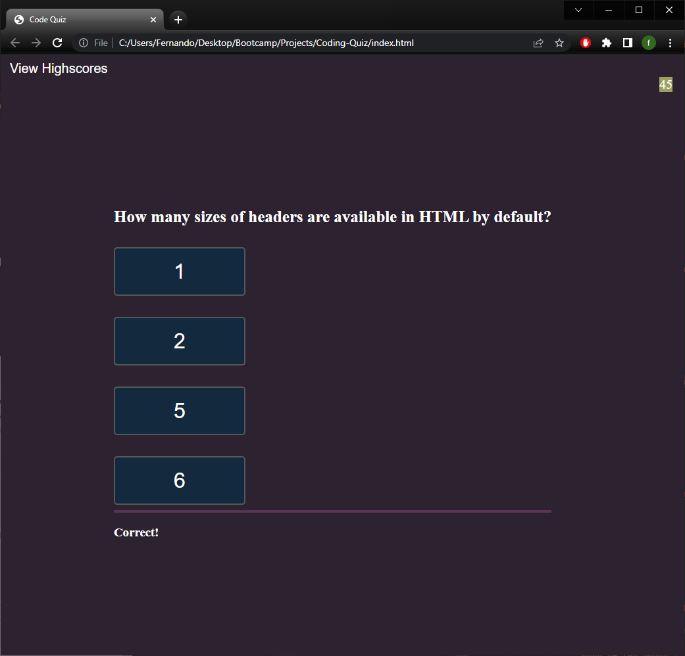
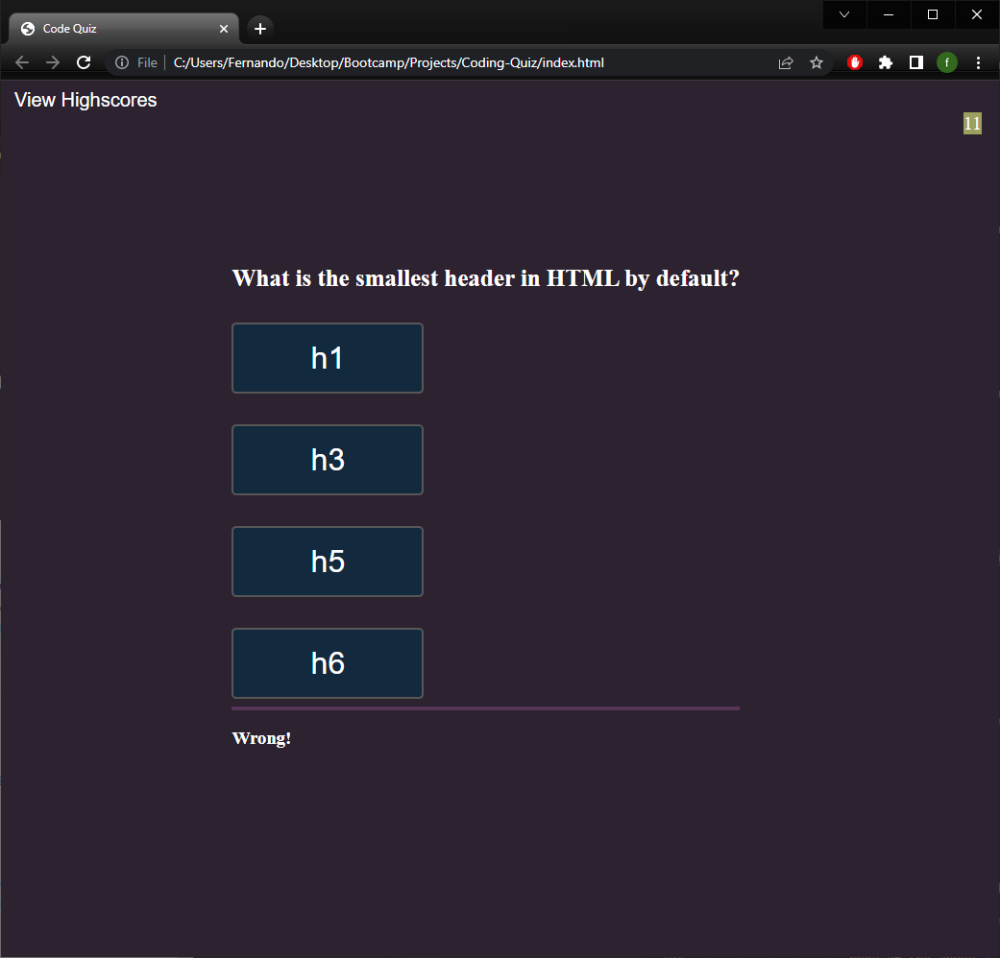
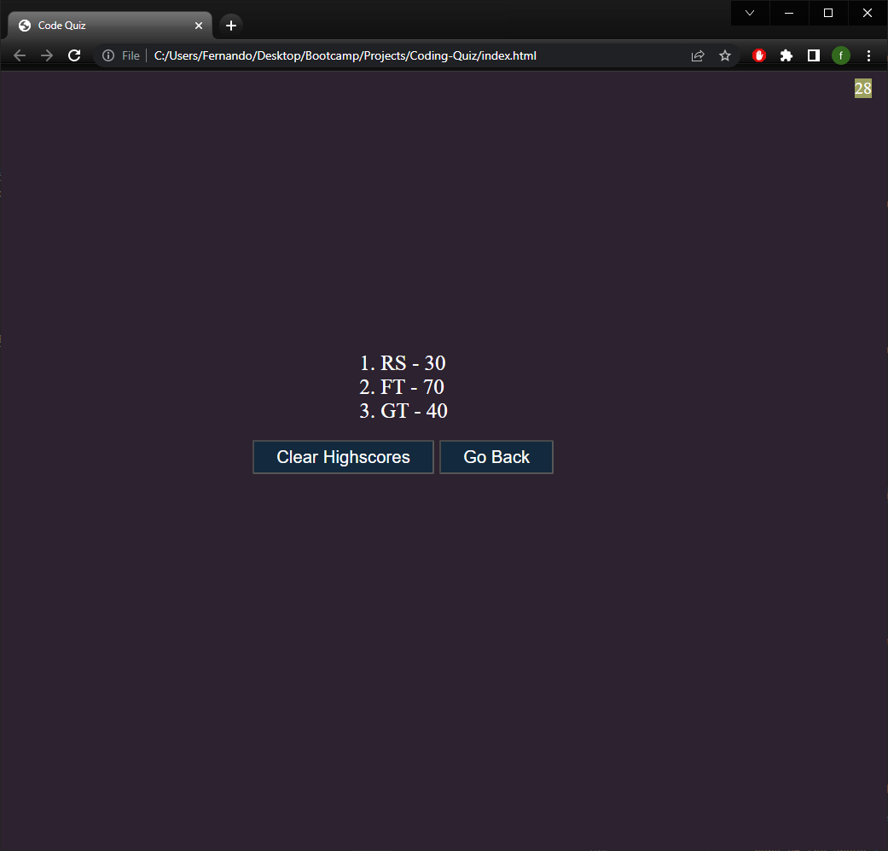

# Coding Quiz

  # 

  ## Table of Contents
  - [Description](#description)
  - [Installation](#install)
  - [Usage](#usage)
  - [License](#license)
  - [Questions](#questions)
  

  ## Description

  This is a timed quiz using JavaScript fundamentals that store your high scores locally. Quiz will deduct seconds
  from your time if answer is incorrect and will stop when time is up or ran out. 

  ## Installation

  - git clone git@github.com:fernandot10/Coding-Quiz.git
  - open index.html in local browser to run app

  ## Usage

  - Start Screen
  

  - Correct Answer
  

  - Wrong Answer 
  

  - Highscores
  

  - [DEPLOYED]()
  - [REPO](https://github.com/fernandot10/Coding-Quiz)

  ## License 
  MIT
  
  ## Questions
  How to reach me...
  - GitHub: https://github.com/fernandot10
  - Email: fernando.t10@outlook.com

  